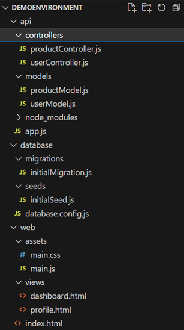

# powershell-os  
*This repo contains an assortment of PowerShell scripts.*

---

### repostructuredocumentation.ps1

*Provided a root level directory, this script will output a visual representation of the folder/file structure beneath.*

For example, given the following repo



and the statement 

```powershell
Get-DirectoryStructure -startLocation "./demoEnvironment" -excludePatterns @('*\node_modules\*') -summarizeFolders @('controllers', 'views')
```

the script will then generate the following output:

``` powershell
demoEnvironment/
├── api/
│   ├── controllers/
│   │   ├── productController.js
│   │   └── userController.js
│   ├── models/
│   │   ├── productModel.js
│   │   └── userModel.js
│   ├── node_modules/
│   │    └── ...
│   └── app.js
├── database/
│   ├── migrations/
│   │   └── initialMigration.js
│   ├── seeds/
│   │   └── initialSeed.js
│   └── database.config.js
└── web/
│   ├── assets/
│   │   ├── main.css
│   │   └── main.js
│   ├── views/
│   │   ├── dashboard.html
│   │   └── profile.html
│   └── index.html
```

---

### geohash.ps1

*Converts a geohash to latitude / longitude pair.*

[Background Info](https://en.wikipedia.org/wiki/Geohash)


---

### haversinedistance.ps1

*Given two pairs of latitude / longitude values, calculates the geographic distance between them.*

[Background Info](https://www.igismap.com/haversine-formula-calculate-geographic-distance-earth/)

---

### azureoauth2.ps1

*Fetches an OAuth2 token from Azure REST API.*

[Reference](https://learn.microsoft.com/en-us/rest/api/azure/)

---

### unusedazureresources.ps1

*Reports empty resources for SQL DBs and App Service Plans. Note: the user must already be logged in to Azure.*

---

### filetoazurestoragecontainer.ps1

*Sends a file to a storage container using access key.*