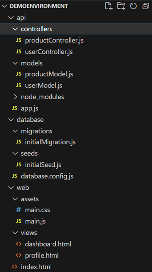

# Script: QifToCsv

This script converts a QIF (Quicken Interchange Format) file to CSV. It was created to assist in exporting personal financial records out of Microsoft Money '97 into more modern software.

## Usage

   ```powershell
   Convert-QIFtoCSV -QifFilePath "C:\path\to\your\input.qif" -CsvFilePath "C:\path\to\your\output.csv"
   ```

---

# Script: RepoStructureDocumentation

A script to recursively display the structure of a directory in a tree format using PowerShell.

This script is similar but distinctly different from PowerShell's built in 'tree' command in that it allows users to summarize folders that contain a large number of items, as well as exclude folder content all together, by using "..." notation after listing the first few child items.

## **Features**
- **Exclusions**: Skip directories or files using pattern-based exclusions.
- **Summarization**: Limit the display for certain directories for a concise view.


## **Usage**

1. Use the `Get-DirectoryStructure` function:
   ```PowerShell
   Get-DirectoryStructure -startLocation "<PathToDirectory>"
   ```

2. **Optional Parameters**:
    - `-excludePatterns`: Patterns to exclude from the view.
      ```PowerShell
      -excludePatterns @('*\node_modules\*', '*\.git\*')
      ```
    - `-summarizeFolders`: Specify folder names to display only a limited view.
      ```PowerShell
      -summarizeFolders @('controllers', 'views')
      ```


## **Example**

Given the repo




use the statement

```powershell
Get-DirectoryStructure -startLocation "./demoEnvironment" -excludePatterns @('*\node_modules\*') -summarizeFolders @('controllers', 'views')
```

to generate the following output:

``` powershell
demoEnvironment/
├── api/
│   ├── controllers/
│   │   ├── productController.js
│   │   └── userController.js
│   ├── models/
│   │   ├── productModel.js
│   │   └── userModel.js
│   ├── node_modules/
│   │    └── ...
│   └── app.js
├── database/
│   ├── migrations/
│   │   └── initialMigration.js
│   ├── seeds/
│   │   └── initialSeed.js
│   └── database.config.js
└── web/
│   ├── assets/
│   │   ├── main.css
│   │   └── main.js
│   ├── views/
│   │   ├── dashboard.html
│   │   └── profile.html
│   └── index.html
```